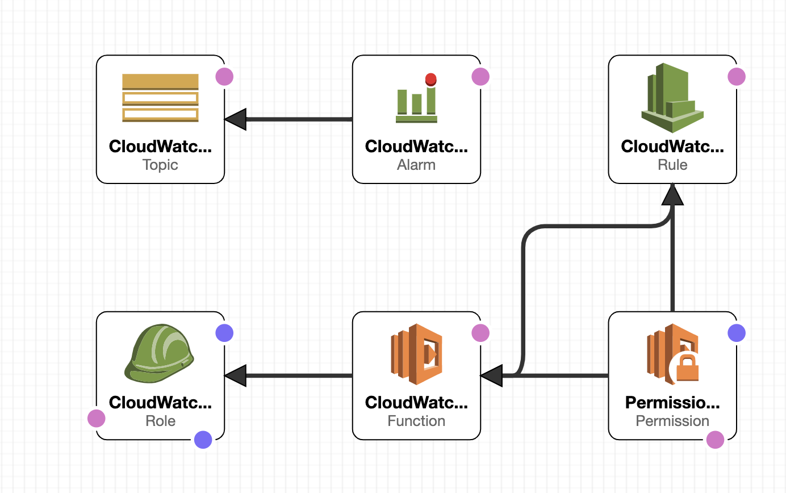
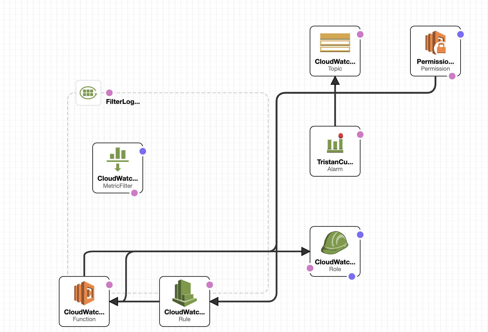

# aws cloudwatch

##Basic

**1. CloudWatch 是什么？我们为什么要使用CloudWatch？**

1) Amazon CloudWatch is a monitoring service for Amazon Web Services cloud resources and the
   applications you run on Amazon Web Services.

2) Use Amazon CloudWatch to collect and track metrics, collect and monitor log files, set alarms,
   and automatically react to changes in your Amazon Web Services resources.With CloudWatch, you gain system-wide visibility into resource utilization, application performance, and operational health

**2. CloudWatch中的metrics是什么？包括哪些种类？我们可以如何使用metrics？**

A metric represents a time-ordered set of data points that are published to CloudWatch. Think of a metric as a variable to monitor, and the data points as representing the values of that variable over time. For example, the CPU usage of a particular EC2 instance is one metric provided by Amazon EC2.

**3.CloudWatch Events是什么？可以应用在那些场景。**

Amazon CloudWatch Events delivers a near real-time stream of system events that describe changes in Amazon Web Services (AWS) resources. Using simple rules that you can quickly set up, you can match events and route them to one or more target functions or streams.

**4. 相关概念理解：metrics，periods，namespace，dimensions，statistics。**

1) namespace: A namespace is a container for CloudWatch metrics. Metrics in different namespaces are isolated from each other, so that metrics from different applications are not mistakenly aggregated into the same statistics.

2) Period: A period is the length of time associated with a specific Amazon CloudWatch statistic. Each statistic represents an aggregation of the metrics data collected for a specified period of time. Periods are defined in numbers of seconds, and valid values for period are 1, 5, 10, 30, or any multiple of 60.

3) dimension: A dimension is a name/value pair that is part of the identity of a metric. You can assign up to 10 dimensions to a metric.Every metric has specific characteristics that describe it, and you can think of dimensions as categories for those characteristics.

4) statistics: Statistics are metric data aggregations over specified periods of time. CloudWatch provides statistics based on the metric data points provided by your custom data or provided by other AWS services to CloudWatch. Aggregations are made using the namespace, metric name, dimensions, and the data point unit of measure, within the time period you specify. The following table describes the available statistics.

## Practice
1)
aws cloudformation create-stack --stack-name cloudwatch-custom-metric-stack --profile tw-aws-beach --template-body file://aws-cloudwatch-custom-metric.yaml  --capabilities CAPABILITY_NAMED_IA

2)
aws cloudformation create-stack --stack-name cloudwatch-log-filter-metric-stack --profile tw-aws-beach --template-body file://aws-cloudwatch-log-filter.yaml --capabilities CAPABILITY_NAMED_IAM

###problem

1. 添加permission之后影响的account的capacity
2. lambda采用不同语言时的handler
3. alarm的Period、EvaluationPeriods、DatapointsToAlarm
